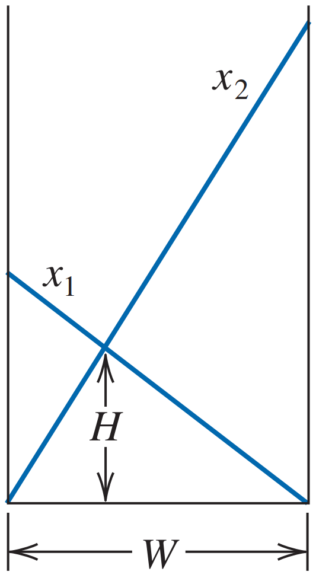
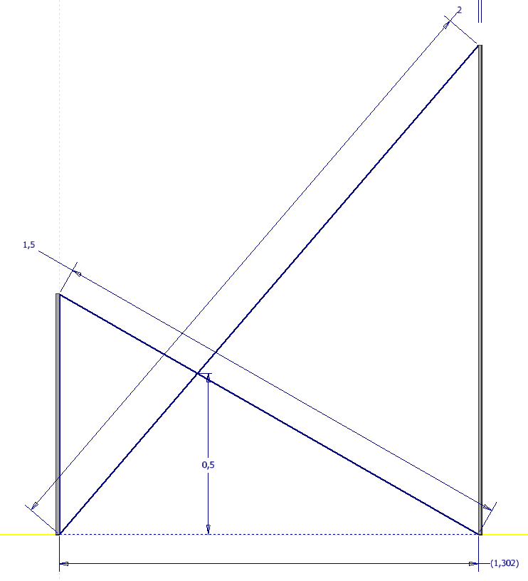

# Proyecto_Arquitectura
Dos escaleras de longitud x1 y x2 están inclinadas desde las paredes opuestas de un pasillo de ancho W , como se muestra en la siguiente figura.
Suponiendoo que se conoce los valores de x1,x2 y H , se debe de encontrar el valor del W.

# Ejemplo
Sea x1=1.5m , x2=2m y H=0.5m, como se muestra a contnuacion el ancho del pasillo seria W=1.302m

# Presentacion
Para poder ver la presentacion, pueden acceder mediante el siguiente enlace:
[https://www.canva.com/design/DAGIiRC6Hp0/lOIOLlg8xqK9g0JT2nd4bw/view?utm_content=DAGIiRC6Hp0&utm_campaign=designshare&utm_medium=link&utm_source=editor]
# Video de prueba
Si quieren observar el funcionamiento del codigo lo pueden hacer dando clik en el siguiente enlace:

